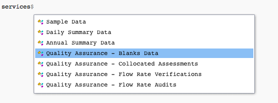
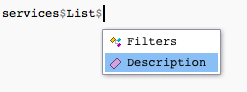
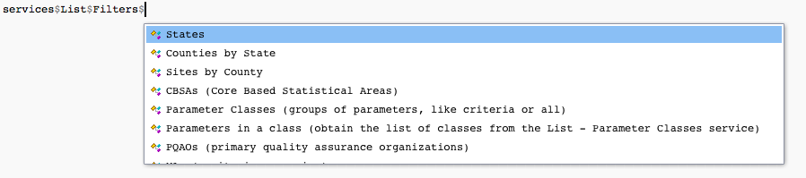

# Making your first call

## See what services the API offers

Be sure to load the package before starting!

``` r

library(epair)
```

At the outset, we may not know exactly what we want from the API. We can
start by taking a look at the `services` object included with the
package. The `services` object is an R list that contains information
about each service offered by the EPA API and how to use it.

If we just want to see a list of services offered, we can try

``` r

names(services)
```

    ##  [1] "MetaData"                                              
    ##  [2] "List"                                                  
    ##  [3] "Monitors"                                              
    ##  [4] "Sample Data"                                           
    ##  [5] "Daily Summary Data"                                    
    ##  [6] "Annual Summary Data"                                   
    ##  [7] "Quality Assurance - Blanks Data"                       
    ##  [8] "Quality Assurance - Collocated Assessments"            
    ##  [9] "Quality Assurance - Flow Rate Verifications"           
    ## [10] "Quality Assurance - Flow Rate Audits"                  
    ## [11] "Quality Assurance - One Point Quality Control Raw Data"
    ## [12] "Quality Assurance - PEP Audits"

If we want to see a description for a particular service, we may type
its name and select it from `services`.

An example for the `MetaData` service is shown below.

``` r

services[["MetaData"]]$Description
```

    ## [1] "Returns information about the API.  Is it available/up?  What are the meanings of the fields in my returned data?Recent and planned changes, etc."

Using RStudio’s smart variable selection, simply typing `services$` will
open up a service to select along with any other useful information
about that service.



Becoming familiar with the `services` object can help you to make calls.
In the [Navigating
services](https://docs.ropensci.org/Useful-Features/Services) page, we
talk in depth about the `services` object.

## A basic call

In this example, we will attempt to list all parameter codes associated
with states in the US.

#### Setup

If you haven’t already read the Anatomy of an API request, we recommend
you do. The post explains how a call is made and may help you in making
your own calls.

Remember to set up your authentication first!

The package automatically includes the base of the call (the base API
site and authentication). To query, we need to find the appropriate
`get` function for our service, or manually provide an endpoint to
[`perform.call()`](https://docs.ropensci.org/epair/reference/perform.call.md)
(to see how you can determine an endpoint see the [Finding
endpoints](https://docs.ropensci.org/Useful-Features/Endpoints) page).

#### Option 1: User friendly functions

To reduce the difficulty of finding the specific endpoint for your API
call, there are a collection of specific `get` functions for each
service and filter combination.

If we were trying to find state parameter codes, this will return all
states and their respective FIPS codes.

``` r

result <- get_state_fips()
```

The `get` function for each service will provide an R list with a
`Header` and `Data` component. The `Header` contains information about
the call and is useful for determining how the call went through.

``` r

result$Header$status
result$Header$request_time
```

To get the actual data we called for (states and their parameter codes),
we use the `Data` component of the result.

``` r

result$Data
```

#### Option 2: Manually placing the call

If we want to make the call manually, we need to determine the
appropriate endpoint for the type of query we wish to make.

Recall that we’re looking for all parameter codes associated with each
state in the US.

We first look at `services`, and select `List`’s description to see if
this is the appropriate service to use.



``` r

services$List$Description
```

    ## [1] "Provides information you need to construct other queries.  Valid values for the required variables: parameter code, state code, etc.  (See below.)"

This seems like the perfect service to use to find state parameter
codes. We select `List`, and then see that there are multiple `Filters`
available for listing.



It looks like `States` would be the most appropriate option here.

``` r

services$List$Filters$States
```

    ## $Endpoint
    ## [1] "list/states"
    ## 
    ## $RequiredVariables
    ## [1] "email, key"
    ## 
    ## $OptionalVariables
    ## [1] ""
    ## 
    ## $Example
    ## [1] "Returns a list of the states and their FIPS codes used for constructing other requests:https://aqs.epa.gov/data/api/list/states?email=test@aqs.api&key=test"

This shows us the endpoint to use and required variables. Since the
`email` and `key` are always included in calls, we need only get the
endpoint to make the call.

``` r

endpoint <- services$List$Filters$States$Endpoint
```

After determining the endpoint, we can make the call using
[`perform.call()`](https://docs.ropensci.org/epair/reference/perform.call.md).

``` r

result <- perform.call(endpoint = endpoint)
```

The
[`perform.call()`](https://docs.ropensci.org/epair/reference/perform.call.md)
function will provide the same R list structure for output as each of
the `get` functions.

Alternatively, if you want the original output from the API,
[`perform.call.raw()`](https://docs.ropensci.org/epair/reference/perform.call.raw.md)
will make a request, and provide the request results raw in JSON format.

``` r

raw.result <- perform.call.raw(endpoint = endpoint)
```
