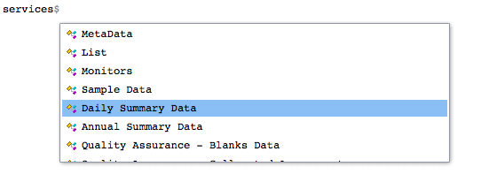
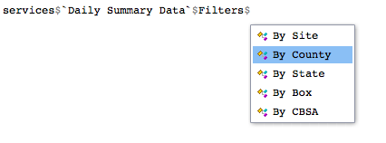
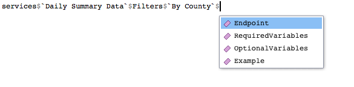

# Finding endpoints

Let’s take a look at how to find endpoints for making queries (see
[Anatomy of an EPA API
request](https://docs.ropensci.org/Tutorial/anatomyEPArequest) if you
don’t know what an endpoint is).

## Simple listing

The `endpoints` object comes loaded with `epair`. `endpoints` is a
vector that provides all EPA API endpoints in use. You can see these by
calling `endpoints`.

``` r

endpoints
```

    ##  [1] "signup"                           "metaData/isAvailable"            
    ##  [3] "metaData/fieldsByService"         "metaData/fieldsByService"        
    ##  [5] "metaData/issues"                  "list/states"                     
    ##  [7] "list/countiesByState"             "list/sitesByCounty"              
    ##  [9] "list/cbsas"                       "list/parametersByClass"          
    ## [11] "list/pqaos"                       "list/mas"                        
    ## [13] "monitors/bySite"                  "monitors/byCounty"               
    ## [15] "monitors/byState"                 "monitors/byBox"                  
    ## [17] "monitors/byCBSA"                  "sampleData/bySite"               
    ## [19] "sampleData/byCounty"              "sampleData/byState"              
    ## [21] "sampleData/byBox"                 "sampleData/byCBSA"               
    ## [23] "dailyData/bySite"                 "dailyData/byCounty"              
    ## [25] "dailyData/byState"                "dailyData/byBox"                 
    ## [27] "dailyData/byCBSA"                 "annualData/bySite"               
    ## [29] "annualData/byCounty"              "annualData/byState"              
    ## [31] "annualData/byBox"                 "annualData/byCBSA"               
    ## [33] "qaBlanks/bySite"                  "qaBlanks/byCounty"               
    ## [35] "qaBlanks/byState"                 "qaBlanks/byPQAO"                 
    ## [37] "qaBlanks/byMA"                    "qaCollocatedAssessments/bySite"  
    ## [39] "qaCollocatedAssessments/byCounty" "qaCollocatedAssessments/byState" 
    ## [41] "qaCollocatedAssessments/byPQAO"   "qaCollocatedAssessments/byMA"    
    ## [43] "qaFlowRateVerifications/bySite"   "qaFlowRateVerifications/byCounty"
    ## [45] "qaFlowRateVerifications/byState"  "qaFlowRateVerifications/byPQAO"  
    ## [47] "qaFlowRateVerifications/byMA"     "qaFlowRateAudits/bySite"         
    ## [49] "qaFlowRateAudits/byCounty"        "qaFlowRateAudits/byState"        
    ## [51] "qaFlowRateAudits/byPQAO"          "qaFlowRateAudits/byMA"           
    ## [53] "qaOnePointQcRawData/bySite"       "qaOnePointQcRawData/byCounty"    
    ## [55] "qaOnePointQcRawData/byState"      "qaOnePointQcRawData/byPQAO"      
    ## [57] "qaOnePointQcRawData/byMA"         "qaPepAudits/bySite"              
    ## [59] "qaPepAudits/byCounty"             "qaPepAudits/byState"             
    ## [61] "qaPepAudits/byPQAO"               "qaPepAudits/byMA"

You could “manually” find a particular endpoint by looking for
similarities with an API service and its endpoint name. For example, to
get annual data for a state, it’s easy to see that `annualData/byState`
is the right endpoint to use.

## Using the services object

Visually sifting through endpoints can be confusing so another approach
is through the `services` object. If you know what API service you want
to use, finding the corresponding endpoint is straightforward.

For example, let’s suppose you want to get daily summary data for a
particular county. Then, using the `services` object we can see the
endpoint as follows.

Select `Daily Summary Data` from `services`.



Then select the appropriate filter, in this case, `By County`.



Then, select `Endpoint`.



``` r

services$`Daily Summary Data`$Filters$`By County`$Endpoint
```

    ## [1] "dailyData/byCounty"

In fact, all endpoints for a service can be found using this general
template.

``` r

 services$ServiceName$Filters$SpecificFilter$Endpoint
```
