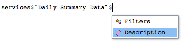
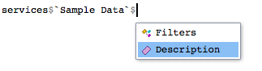
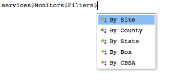

# Navigating API Services

## The services object

The `services` object comes loaded with the package. It is an R list
containing comprehensive information about each service offered in the
EPA API.

We can see all services available by using
[`names()`](https://rdrr.io/r/base/names.html).

``` r

names(services)
```

    ##  [1] "MetaData"                                              
    ##  [2] "List"                                                  
    ##  [3] "Monitors"                                              
    ##  [4] "Sample Data"                                           
    ##  [5] "Daily Summary Data"                                    
    ##  [6] "Annual Summary Data"                                   
    ##  [7] "Quality Assurance - Blanks Data"                       
    ##  [8] "Quality Assurance - Collocated Assessments"            
    ##  [9] "Quality Assurance - Flow Rate Verifications"           
    ## [10] "Quality Assurance - Flow Rate Audits"                  
    ## [11] "Quality Assurance - One Point Quality Control Raw Data"
    ## [12] "Quality Assurance - PEP Audits"

Alternatively, using RStudio’s smart variable selection, you can type
`services$` to see the available services.


### What service to use

You can also see a description for each service. This helps determine
what service to use. For example, suppose you want to find hourly data
in a particular state. Perhaps these data are contained in a daily
summary so you can check the description.



``` r

services$`Daily Summary Data`$Description
```

    ## [1] "Returns data summarized at the daily level.  All daily summaries are calculated on midnight to midnight basis inlocal time.  Variables returned include date, mean value, maximum value, etc."

The description suggests hourly data may be used to produce the values,
but we may not necessarily get hourly data.

So we try a different service description.



``` r

services$`Sample Data`$Description
```

    ## [1] "Returns sample data - the finest grain data reported to EPA.  Usually hourly, sometimes 5-minute, 12-hour, etc. This service is available in several geographic selections based on geography: site, county, state, CBSA (core based statistical area, a grouping of counties), or latitude/longitude bounding box."

This service seems more appropriate to what we need. It specifically
mentions hourly data and might even offer finer grain data.

In general, to find the description of a service, you can type the
following.

``` r

service$ServiceName$Description
```

### Filters

Most API services also have a component called a *filter*. This refers
to a filter applied to desired data. For example, if we want to find
information on weather monitors, we should specify monitors in a state
vs a county. The `services` object contains a `Filters` component that
lets the user find out how final data can be filtered. Using the weather
monitors example, we can see the filters available as follows.

``` r

names(services$Monitors$Filters)
```

    ## [1] "By Site"   "By County" "By State"  "By Box"    "By CBSA"

Or, we can use `servics$Monitors$Filters$` to see available filters.



The `Filters` component in the `services` object contains all
information you might need to make a call. It has the endpoint, required
API variables, optional API variables (if appropriate), and a URL
example of a call.

In general, to see available filters, you can type the following:

``` r

names(services$ServiceName$Filters)
```

Or, using RStudio’s smart variable selection:

``` r
services$ServiceName$Filters$
```

### Further information

After seeing what filter to use, you can see the requirements to make a
call. As mentioned above, the `Filters` component contains an endpoint,
required API variable, optional API variable, and an example URL. Each
of these helps when trying to build a call with the package.

For instance, say you want to find annual data for a state in the US.
You can look at the filters for the annual data service to see how to
build the call.

``` r

services$`Annual Summary Data`$Filters$`By State`
```

    ## $Endpoint
    ## [1] "annualData/byState"
    ## 
    ## $RequiredVariables
    ## [1] "email, key, param, bdate, edate, state"
    ## 
    ## $OptionalVariables
    ## [1] "cbdate,cedate"
    ## 
    ## $Example
    ## [1] "Example; returns all benzene annual summaries from North Carolina collected for 1995:https://aqs.epa.gov/data/api/annualData/byState?email=test@aqs.api&key=test&param=45201&bdate=19950515&edate=19950515&state=37"

In general, you can find information for making a call using a specific
filter as follows:

``` r

services$ServiceName$Filters$SpecificFilter
```
